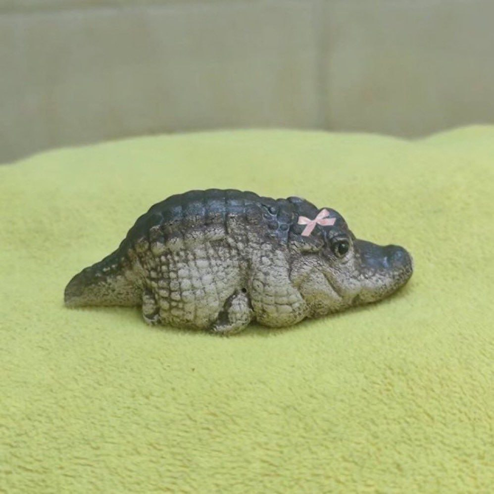
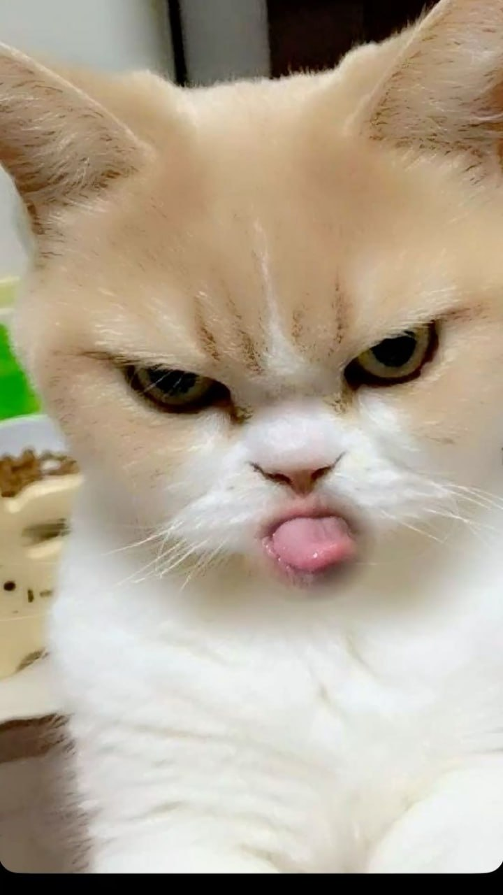

# Heading one
## Heading two
### Heading three
#### Heading four

## text time
hrello **bold**

*italic text*

~~delete tect~~
## sheck lish1

- [X] task 1
- [X] task 2
- [] task 3
- [] task 4

## table
|id | name | age | status |
|---|------|-----|--------|
|01 |vanna |200  | true   |
|01 |vanna |200  | true   |
|01 |vanna |200  | true   |
|01 |vanna |200  | true   |

## lish
- lish  1 
- lish   2
- lish   3
- lish   5
    - sub 1
    - sub 2
    - sub 3

1. List 1
2. List 4
3. List 3
    1. sub 1
    3. sub 1
    3. sub 1

## image 




### link
css Framwork [[youtub]](https://www.youtube.com/)


## singlie line code
`print("hello word")`

## multiple line
```python
for i in range(10):
    print(i)
```
```html
<h1>Hello</h1>
<p> text</p>
```
```bash
npm i express
pip install cv2
composer install
```

## Button

<a href="ttps://www.youtube.com/" target="_blank">youtube</a>

# Badge
 [](https://www.youtube.com/)

 ## Contributor
 - [@vanna-023]